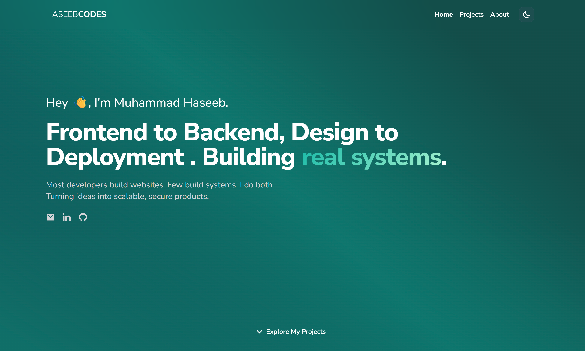

# Muhammad Haseeb – Portfolio Website

This is my personal portfolio website built from scratch using React, Tailwind CSS, and Vite. It highlights my skills, showcases selected projects, and offers a way to connect with me professionally.

## 📺 Preview


## 🚀 Features

- ⚡ Fast and lightweight (Vite + React)
- 🎨 Fully responsive and mobile-friendly design
- 🌙 Dark mode support (if added)
- 🧩 Modular and clean component structure
- 🧰 Tailwind CSS for rapid styling

## 🛠️ Built With

- [React](https://reactjs.org/)
- [Vite](https://vitejs.dev/)
- [Tailwind CSS](https://tailwindcss.com/)
- [React Icons](https://react-icons.github.io/react-icons/) (optional)
- [Framer Motion](https://www.framer.com/motion/) (for animations, if used)

## 📁 Folder Structure
haseeb-portfolio/
├── public/
├── src/
│ ├── assets/
│ ├── components/
│ ├── pages/
│ └── App.jsx
├── .gitignore
├── index.html
├── package.json
└── tailwind.config.js

## 🚀 Quick Start

```bash
# Clone the repository
git clone https://github.com/Haseeb-1698/haseeb-portfolio.git
cd haseeb-portfolio
npm install
npm run dev
```

## 📬 Contact
Feel free to reach out via [LinkedIn](https://www.linkedin.com/in/muhammad-haseeb-38371b296?utm_source=share&utm_campaign=share_via&utm_content=profile&utm_medium=ios_app) or email me at [muhammad.haseeb@gmail.com](mailto:muhammad.haseeb@gmail.com).

## 🌐 Live Demo
Visit my portfolio here: [HASEEBCODES](https://haseeb-1698.netlify.app/)
